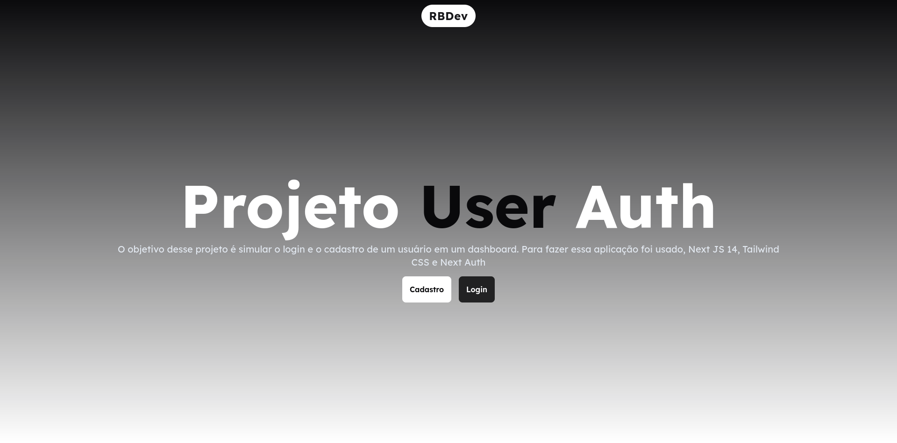

## Introdução

O Projeto "User Auth" surgiu como uma ideia de estudar e praticar a autenticação em websites que utilizam o framework Next JS. Para realizar esse projeto escolhi a biblioteca Next Auth, uma biblioteca open source e full stack que oferece uma maneira simples e flexível de adicionar autenticação a aplicativos Next.js, suportando uma variedade de provedores de autenticação, como provedores OAuth (Google, Facebook, GitHub, etc.), provedores de autenticação de senha, JWT e muito mais.

### Tecnologias Utilizadas

- **Linguagens de Programação**: TypeScript
- **Frameworks e Bibliotecas**:
  - shadcn/ui
  - axios
  - json-server
  - next
  - next-auth
  - react-hook-form
  - tailwind
  - zod

### Ideias Principais

- Criar duas páginas responsáveis pelo Login e Registro do Usuário.
- Armazenar os dados de Registro do Usuário em um db, no caso, foi usado json-server para simular chamadas de registro do usuário.
- Fazer a validação do formulário.
- Criar uma sessão para o usuário e ao fazer o login permitir que o usuário:
  - Faça Logout
  - Veja suas informações (Nome de usuário, Email, Senha)
- Criar um dashboard personalizado para o usuário com algumas informações adicionais.

## Desenvolvimento

O desenvolvimento do projeto foi dividido em 3 etapas, cada uma focada em aspectos específicos do projeto.

1. **Organização e Desenho de Ideias**: Nesta fase, levei um tempo para pensar qual seria o melhor design para as duas principais páginas do projeto, bem como para o dashboard. Realizei uma pesquisa em alguns sites e, em seguida, decidi desenhar um protótipo da tela de login na ferramenta online Excalidraw.

2. **Criação do Projeto e Desenvolvimento**:

   - **Criação do Projeto**: A ideia principal é estudar a biblioteca Next Auth, então escolhi o Next.js (Versão 14.1.0) como framework do React para criar o projeto. Para estilizar o projeto, optei pelo TailwindCSS, um framework que facilita muito o desenvolvimento, especialmente em aspectos como responsividade e manipulação de variáveis globais.
   - **Etapas de Criação das Telas**:
     - Página Inicial
     - Login
     - Registro
     - Dashboard
   - **Adição de Validação nos Campos dos Formulários**: Utilizei Zod e React-Hook-Form para adicionar validação nos campos dos formulários.
   - **Persistência de Dados no json-server**: Utilizei axios para persistir os dados no json-server.
   - **Criação da Sessão do Usuário com Next Auth**: Baseado nas informações de registro do usuário, criei a sessão do usuário.
   - **Exibição dos Dados Acessados na Sessão no Dashboard**.

3. **Testes**:

## Resultado

Após um processo de desenvolvimento cuidadoso e meticuloso, o projeto "User Auth" alcançou resultados significativos. Abaixo estão os principais destaques:

- **Design e Organização**: A fase inicial de organização e desenho de ideias resultou em um layout intuitivo e agradável para as páginas de login, registro e dashboard. O protótipo desenvolvido na ferramenta Excalidraw serviu como uma base sólida para a implementação posterior.

- **Tecnologias Utilizadas**: A escolha do Next.js como framework principal e do TailwindCSS para estilização mostrou-se acertada, facilitando o desenvolvimento e garantindo um código limpo e responsivo. A integração de bibliotecas como Zod, React-Hook-Form e Next Auth contribuiu para a robustez e segurança do projeto.

- **Funcionalidades Implementadas**: As funcionalidades essenciais, como login, registro, validação de formulários, persistência de dados e criação de sessão de usuário, foram implementadas com sucesso. O uso do json-server permitiu simular chamadas de registro do usuário de forma eficaz.

- **Experiência do Usuário**: Com a criação da sessão do usuário e a exibição dos dados acessados no dashboard, proporcionamos uma experiência interativa e personalizada para os usuários, permitindo-lhes gerenciar suas informações de forma eficiente.

No geral, o projeto "User Auth" atingiu seus objetivos principais de estudar e praticar autenticação em websites usando Next.js e Next Auth. Além disso, serviu como uma oportunidade valiosa para explorar e aprimorar habilidades em desenvolvimento web. Com uma base sólida estabelecida, o projeto está pronto para futuras expansões e melhorias.

### Ideias Futuras

Apesar do projeto "User Auth" já ter alcançado seus objetivos iniciais, existem várias oportunidades para expandir e aprimorar suas funcionalidades no futuro. Algumas ideias incluem:

1. **Implementação de Novos Provedores de Autenticação**: Integração de provedores de autenticação adicionais, como LinkedIn, Twitter, ou outros provedores OAuth, para oferecer aos usuários mais opções de login.

2. **Funcionalidades Adicionais no Dashboard**: Expansão do dashboard com novas funcionalidades, como visualização de atividades recentes, configurações de perfil, ou até mesmo integração com serviços externos, como calendários ou ferramentas de produtividade.

3. **Implementação de Recursos de Segurança Avançados**: Adição de medidas de segurança avançadas, como autenticação de dois fatores (2FA) ou monitoramento de atividades suspeitas, para proteger ainda mais as contas dos usuários.

4. **Otimização de Desempenho e Escalabilidade**: Identificação e correção de possíveis gargalos de desempenho e escalabilidade no código, garantindo que o projeto possa lidar com um aumento no número de usuários sem comprometer a velocidade ou a estabilidade.

5. **Integração com Serviços de Terceiros**: Exploração de integrações com serviços de terceiros, como sistemas de análise de dados, serviços de e-mail marketing, ou plataformas de mensagens, para ampliar as capacidades do projeto e oferecer aos usuários uma experiência mais completa.

Essas são apenas algumas ideias para futuras melhorias e expansões do projeto "User Auth".
